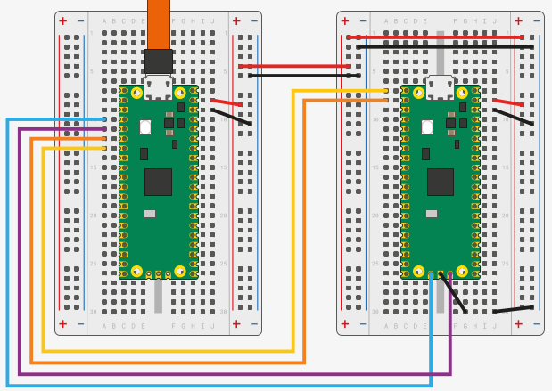

# Debug RP2040 using VScode and DebugProbe

Experiments debugging a rp2040 using the debugprobe

## Links

* https://github.com/raspberrypi/documentation/tree/develop/documentation/asciidoc/microcontrollers/debug-probe

  Documentation

* https://github.com/raspberrypi/pico-vscode

  Identifier: raspberry-pi.raspberry-pi-pico

* https://datasheets.raspberrypi.com/pico/getting-started-with-pico.pdf

  Chapter 4. Load and debug a project

## Example Source code

Combinded code from:

* https://github.com/raspberrypi/pico-examples/blob/master/blink/blink.c
* https://github.com/raspberrypi/pico-examples/blob/master/uart/hello_uart/hello_uart.c

## Debug Probe

LEDs: Red: Power
LEDs: SWD-Green,SWD-Orange: Always on after debugger has connected
LEDs: UART-Green: blinks while RX (DUT -> PC)
LEDs: UART-Orange: blinks while TX (PC -> DUT)

### Debugging with RP2040 using debugprobe_on_pico.uf2/board_pico_config.h

Wiring, see:


Tested: Debug and UART works ok

### Debugging with RP2040 using debugprobe.uf2/board_debug_probe_config.h


Wiring

| Function | Probe (left) | DUT (right) | Comment |
| - | - | - | - |
| GND black | 38 | 38 | same as debugprobe_on_pico.uf2 |
| VSYS red | 39 | 39 | same as debugprobe_on_pico.uf2 |
| UART orange | 6 (GPIO4, TX) | 2 (GPIO1, RX) | same as debugprobe_on_pico.uf2 |
| UART  yellow | 7 (GPIO5, RX) | 1 (GPIO0, TX) | same as debugprobe_on_pico.uf2 |
| SWD blue | CLK | 16 (GPIO12) | SWCLK |
| SWD violet | DIO | 19 (GPIO14) | SWDIO |

This resulted in below error:

```bash
Open On-Chip Debugger 0.12.0+dev-gebec950-dirty (2024-09-27-16:25)
Licensed under GNU GPL v2
For bug reports, read
        http://openocd.org/doc/doxygen/bugs.html
CDLiveWatchSetup
Info : Hardware thread awareness created
Info : Hardware thread awareness created
adapter speed: 5000 kHz
Info : Listening on port 50001 for tcl connections
Info : Listening on port 50002 for telnet connections
Info : Using CMSIS-DAPv2 interface with VID:PID=0x2e8a:0x000c, serial=4250314637373807
Info : CMSIS-DAP: SWD supported
Info : CMSIS-DAP: Atomic commands supported
Info : CMSIS-DAP: Test domain timer supported
Info : CMSIS-DAP: FW Version = 2.0.0
Info : CMSIS-DAP: Interface Initialised (SWD)
Info : SWCLK/TCK = 0 SWDIO/TMS = 0 TDI = 0 TDO = 0 nTRST = 0 nRESET = 0
Info : CMSIS-DAP: Interface ready
Info : clock speed 5000 kHz
Warn : Too long SWD WAIT, issuing DAPABORT
Warn : Too long SWD WAIT, issuing DAPABORT
Warn : Too long SWD WAIT, issuing DAPABORT
Error: Failed to connect multidrop rp2040.dap0
```

## FAQ

* Could not start GDB process, does the program exist in filesystem?

  `sudo apt-get install gdb-multiarch`

* Open On-Chip Debugger. Error: unable to find a matching CMSIS-DAP device

  https://github.com/raspberrypi/openocd/blob/sdk-2.0.0/contrib/60-openocd.rules